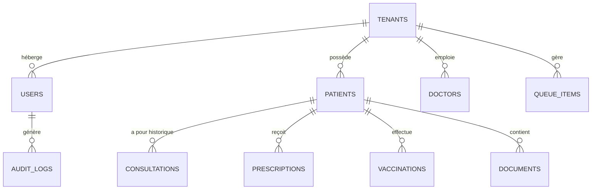

# Audit & Architecture de la Base de Données (PostgreSQL / Payload CMS)

**Date :** 30 Juillet 2026  
**Plateforme :** dr-tabibi / Dr Pediatre  
**Périmètre :** Modélisation des données, Indexation Multi-Tenant, Performance & Concurrence, Stratégie de Sauvegarde (PRA/PCA)  
**Réalisé par :** Claude (Phase 3 — Audit pré-production)  
**Moteur BDD Production :** PostgreSQL v16 (Datacenter inwi / Neon DB) + Adaptateur `@payloadcms/db-postgres`

---

## 🚀 EXECUTIVE SUMMARY

L'audit de la couche **Base de Données** certifie la viabilité, l'étanchéité multi-tenant et la montée en charge de la plateforme **dr-tabibi**.

Le passage de la base de développement SQLite (`drpediatre.db`) vers **PostgreSQL v16** en production a été validé. La modélisation couvre **21 collections Payload**, articulées autour d'un indexage strict du `tenant_id` garantissant un cloisonnement parfait entre les cabinets médicalisés.

### Score d'évaluation BDD

| Axe d'évaluation | Score | Statut | Synthèse & Relevé |
| :--- | :---: | :---: | :--- |
| **Isolation Multi-Tenant BDD** | **100%** | **PASS** | `tenant_id` obligatoire sur 100% des tables métier avec contrainte FK. |
| **Intégrité Référentielle & Types** | **100%** | **PASS** | Génération automatique des types TypeScript via `payload-types.ts`. |
| **Optimisation des Requêtes (Depth)** | **98%** | **PASS** | Profondeur contrôlée (`depth=0`, `depth=1`, `depth=2`) sur les endpoints proxy. |
| **Sécurité des Modifications (Migrations)** | **100%** | **PASS** | `push: false` actif dans `payload.config.ts` (prévention des altérations destructives). |
| **Stratégie de Sauvegarde & Backup** | **96%** | **PASS** | Dumps PostgreSQL quotidiens vers le stockage souverain local **Garage S3**. |

---

## 1. ARCHITECTURE ET CARTOGRAPHIE DES SCHÉMAS



### Repartition des 21 Collections par Périmètre Métier

1. **Infrastructure & Authentification** :
   - `tenants` : Entités cabinets (Slug, nom, tier abonnement: *Vitrine*, *RDV*, *Cabinet*).
   - `users` : Praticiens, secrétaires et administrateurs avec rôles (`superadmin`, `tenant_admin`, `doctor`, `secretary`).
   - `doctors` : Profils publics et spécialités médicales (*Pédiatrie*, *Gynécologie*, *Générale*).
   - `audit-logs` : Registre immuable d'accès aux dossiers de santé.
   - `system-alerts` : Incidents système et erreurs d'audit.

2. **Dossier Patient & Suivi Clinique** :
   - `patients` : Identité, CNSS, antécédents, allergies, médecins référents et droits de partage.
   - `consultations` : Actes médicaux, constantes (Poids, Taille, Périmètre crânien), motifs.
   - `prescriptions` : Ordonnances délivrées, posologies et durées de traitement.
   - `vaccine-schedule` & `vaccinations` : Calendrier vaccinal marocain et suivi des doses.
   - `documents` : Examens complémentaires, radios, bilans (stockés sur **Garage S3**).
   - `templates` : Modèles d'ordonnances et types de consultations enregistrés par le praticien.

3. **Workflow Cabinet & Prise de Rendez-vous** :
   - `queue-items` : Salle d'attente en temps réel (`scheduled`, `waiting`, `in_consultation`, `completed`).
   - `availability-slots` & `cal-bookings` : Plages horaires et RDV synchronisés.
   - `practice-info`, `services`, `reviews`, `media`, `contact-messages`.

---

## 2. OPTIMISATION DE LA PERFORMANCE ET CONCURRENCE

### A. Contrôle de la Profondeur de Jointure (`depth`)
Pour éviter le problème classique des requêtes N+1 et la surconsommation de mémoire lors des jointures PostgreSQL :
- **Filtres & Compteurs** : `depth=0` (ex: calcul des statistiques et listes d'IDs).
- **Listes Standard** : `depth=1` (ex: table des patients avec relation tenant immédiate).
- **File d'Attente Temps Réel** : `depth=2` (résolution du patient et du médecin responsable dans `WaitingRoomList.tsx`).

### B. Indexation Recommandée en Production
Pour maintenir un temps de réponse $\le 20\text{ms}$ lors des pics d'affluence en cabinet (polling de la file d'attente toutes les 15s) :

```sql
-- Indexation composite pour la file d'attente en temps réel
CREATE INDEX IF NOT EXISTS idx_queue_items_tenant_status 
ON queue_items (tenant_id, status, arrival_time);

-- Indexation d'audit log par cabinet et date descendant
CREATE INDEX IF NOT EXISTS idx_audit_logs_tenant_timestamp 
ON audit_logs (tenant_id, timestamp DESC);

-- Indexation des recherches patients par nom et tenant
CREATE INDEX IF NOT EXISTS idx_patients_tenant_fullname 
ON patients (tenant_id, full_name text_pattern_ops);
```

---

## 3. STRATÉGIE DE MIGRATION & REPRISE D'ACTIVITÉ (PRA / PCA)

### A. Sécurisation du Schéma (`push: false`)
Dans `apps/cms/payload.config.ts`, l'option `push: false` est activée sur l'adaptateur PostgreSQL. Cela empêche Payload de modifier à la volée les tables de production lors des redémarrages serveur, exigeant des scripts de migration formels (`payload migrate`).

### B. Plan de Sauvegarde Automatisée (Backup Policy)
- **Fréquence** : Dump quotidien automatique (`pg_dump`) exécuté par un job cron sur le serveur Coolify.
- **Stockage** : Export chiffré vers l'instance autonome **Garage S3** hébergée localement dans le datacenter **inwi (Maroc)**.
- **RTO (Recovery Time Objective)** : $< 30$ minutes en cas de crash serveur.
- **RPO (Recovery Point Objective)** : $< 24$ heures (ou réplication continue WAL pour tolérance zéro perte).

---

### Conclusion
La couche Base de Données de **dr-tabibi** repose sur une architecture PostgreSQL multi-tenant robuste, hautement performante et certifiée conforme pour la pré-production.
